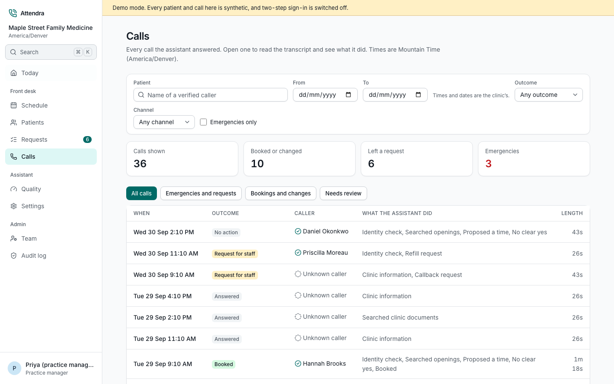
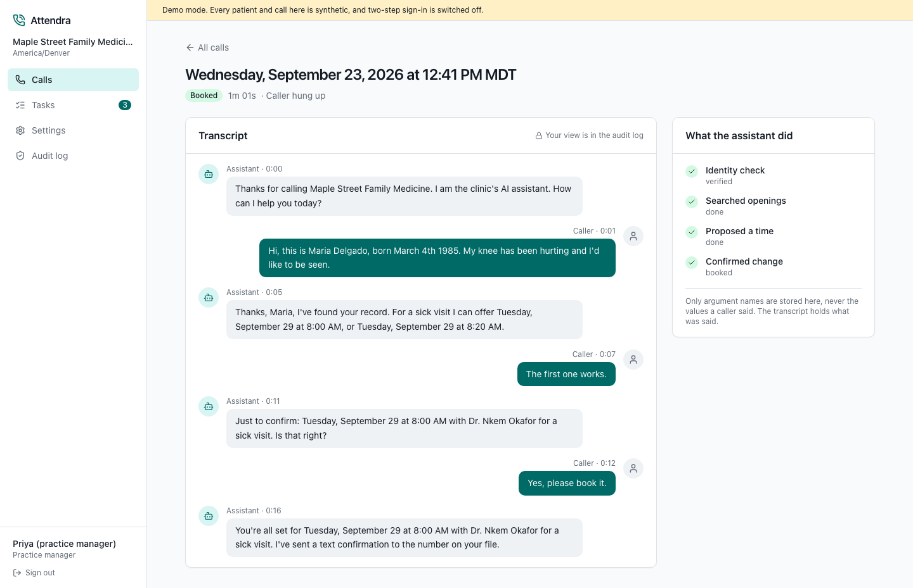
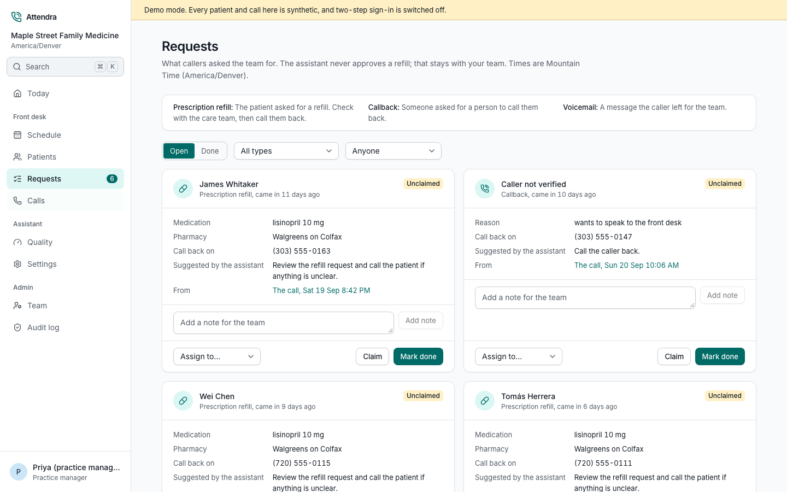
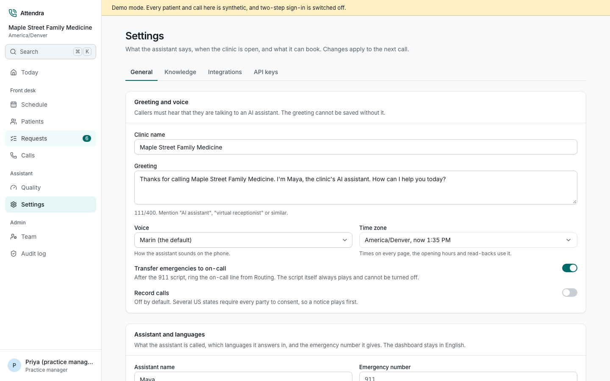

# Attendra

**An open-source AI receptionist for medical practices.** It answers the clinic's phone line day and night, verifies the caller, books, moves and cancels appointments, takes refill and callback requests, answers everyday questions from the clinic's own FAQ, and hands anything clinical or urgent to a person.

Twilio carries the call over SIP to OpenAI GPT-Live, which holds the conversation. Every decision that matters (who the caller is, which times are really free, whether the caller said yes, what gets written, who is told) runs in this repository's TypeScript backend, where it can be tested, audited and self-hosted.

> **Status: v0.2, pre-pilot.** The call path, the backend brain, the scheduler, the eval suite and the staff dashboard work and are tested. Live call take-over and the background worker are next (see the [roadmap](docs/roadmap.md)). Attendra is *HIPAA-ready*, not HIPAA-certified: you need BAAs with your providers before any real patient data goes through it. Read [docs/hipaa.md](docs/hipaa.md) first.

## One call, end to end

At 8 pm Maria calls the clinic about knee pain.

1. Twilio receives the call and sends it over an Elastic SIP Trunk to `sip.api.openai.com`.
2. OpenAI sends `live.transport.incoming` to `apps/voice`. We verify the signature, drop duplicate deliveries, find the clinic from the dialled number and accept with its greeting, hours and voice.
3. We attach to the call's sideband socket. Every caller transcript fragment goes through the emergency guardrail before anything else.
4. Maria asks for an appointment. GPT-Live delegates to our backend, which verifies her name and date of birth, finds real openings and offers three.
5. She picks one. The backend stages the booking and returns the read-back. The booking is written only after Maria's own words contain a clear yes, and the write carries an idempotency key, so a retried delegation cannot book twice.
6. She gets one confirmation text at the number on her record. The call, the transcript (encrypted) and every tool action are stored, and the front desk sees them in the dashboard a few seconds after she hangs up.

Had Maria said "I have chest pain", the backend would have stopped the task (any pending change is dropped and further writes are refused), told her to hang up and call 911, and, if the clinic enabled it, transferred the call to the on-call line a few seconds later. It never gives medical advice.

```
Caller ─PSTN─▶ Twilio ─Elastic SIP (TLS/SRTP)─▶ OpenAI GPT-Live ◀─sideband WS─┐
                                                     │                          │
                             webhook live.transport.incoming                     │
                                                     ▼                          │
                                  apps/voice (Fastify) ── CallRunner ───────────┘
                                                     │
                                  packages/agent: CallAgent + runTool (the rules)
                                     │            │             │           │
                              scheduling      identity      tasks, SMS     audit
                                     └────────── Postgres 16, RLS, encrypted PHI ──┘
```

## What is enforced in code, not in a prompt

Prompts guide the voice. The rules below live in [`packages/agent/src/tools.ts`](packages/agent/src/tools.ts) and [`packages/core`](packages/core/src), and each has a test that tries to break it:

| Rule | Where | Proven by |
|---|---|---|
| Nothing patient-specific before a name and date-of-birth match | `runTool` | `identity_required` in agent tests and the `no-identity-no-records` scenario |
| Only slots the caller was actually offered can be booked | `CallState.offered` | `invented-slot` scenario |
| No write without a spoken read-back and a clear yes to it in the caller's own words | `CallState.answerToReadback`, `commit_pending` | `hedge-is-not-yes` scenario, "yes before the read-back" test |
| Every write is idempotent; the database refuses overlapping bookings | idempotency keys, a Postgres exclusion constraint | scheduler tests |
| An outdated request can neither write nor speak | task revisions in `CallAgent` and `runTool` | "discards a slow result" and "refuses the writes" tests |
| The emergency guardrail runs on every caller fragment, keeps listening after the first match, and cannot be turned off | `detectEmergencies`, `CallAgent.onCallerTranscript` | `emergency-chest-pain`, `self-harm-language`, `not-an-emergency` |
| Refills and callbacks become staff tasks, never decisions | `create_refill_request` | `refill-request` scenario |
| Clinics cannot see each other's data, even through a query with no filter | Postgres Row Level Security | `tenancy-and-phi.test.ts` |
| Names, dates of birth, phone numbers and transcripts are encrypted at rest and never logged | `createPhiCipher`, the redacting logger | `redaction.test.ts`, the ciphertext test |
| Staff need two-factor before any clinic data; a viewer never sees a transcript; another clinic's data is a 404 | `StaffGuard`, `apps/api/src/access.ts` | `apps/api/test/api.test.ts` |
| Every transcript and task view is audited in the same transaction as the read | `FrontDeskRepository` | `front-desk.test.ts` |

## Quick start

You need Node 22 and pnpm 10.

```bash
pnpm install
pnpm test        # unit, Postgres integration (in-process) and the call scenarios
pnpm eval        # the call scenarios as a readable report
```

No keys are needed for either. The scenarios run the real backend against a real Postgres, with a scripted planner standing in for the model; the scripts deliberately try things the backend must refuse. `pnpm eval --live` runs the same calls with the real planner model (needs `OPENAI_API_KEY`).

### See the dashboard

```bash
pnpm demo        # then open http://localhost:3000
```

This starts the API on an in-memory Postgres, plays every call scenario through the real agent into it as a week of calls, fills three weeks of the calendar around today, and starts the dashboard: Today (what needs someone, the day's appointments and what the assistant did), the calls, the schedule (book, move and cancel with the same rules the assistant uses), patients (search, add, and each patient's visits, calls and requests), the refill and callback queue, settings and the audit log. Sign in as `manager@maple-demo.test` (practice manager) or `frontdesk@maple-demo.test` (front desk); the password is `attendra-demo-password`. Everything is synthetic and gone when you stop it. Demo mode skips two-step sign-in; a real deployment never does.

| The week's calls | One call: transcript and every tool step |
|---|---|
|  |  |
| **Refills and callbacks for the front desk** | **Clinic settings, validated before they save** |
|  |  |

### Talk to it

Put an OpenAI key in `.env` at the repo root (`OPENAI_API_KEY=sk-...`) and run `pnpm demo` again. The dashboard's **Test call** page then talks to the demo clinic's receptionist through your microphone, about $0.05 a minute. No phone number needed: [docs/test-calls.md](docs/test-calls.md).

### Take a real call

[docs/live-call.md](docs/live-call.md) takes a small server to a real phone number the demo clinic answers, in about an hour. For your own clinic, follow [docs/self-hosting.md](docs/self-hosting.md).

## Repository layout

```
apps/voice/            the webhook and the per-call runner (Fastify)
apps/api/              the dashboard API: Better Auth, roles, calls, schedule, patients, tasks, settings, audit (NestJS)
apps/web/              the staff dashboard (Next.js, Tailwind, TanStack Query), Playwright specs in e2e/
packages/core/         clinic config, hours, slots, routing, identity, emergency and confirmation rules, the ports
packages/agent/        CallState, the tools and their guards, the delegation loop, the Responses API planner
packages/voice-engine/ the VoiceEngine interface and the GPT-Live implementation; prompt; CallRunner
packages/scheduling/   the booking rules and the one write both the assistant and the front desk use; the built-in SchedulerAdapter (EHR adapters implement the same interface)
packages/telephony/    SIP header parsing, templated SMS through Twilio
packages/db/           SQL migrations with RLS, Drizzle schema, PHI encryption, repositories, synthetic seed
packages/observability the redacting logger
evals/                 call scenarios (YAML) and the simulator that runs them
infra/                 Docker Compose and the images
docs/                  architecture, safety, HIPAA, self-hosting, roadmap, decision records
```

## Contributing

Issues and pull requests are welcome. Read [CONTRIBUTING.md](CONTRIBUTING.md) first: commits need a DCO sign-off, agent behaviour needs an eval scenario, and real patient data never goes anywhere in this repository, including issues.

Security reports go through [private vulnerability reporting](SECURITY.md), not public issues.

## License

[AGPL-3.0-only](LICENSE). You can run, modify and self-host Attendra freely. If you offer a modified version to others over a network, you must share your changes under the same license.

Built and maintained by [Elegant IT Limited](https://eleganttechbd.com).
