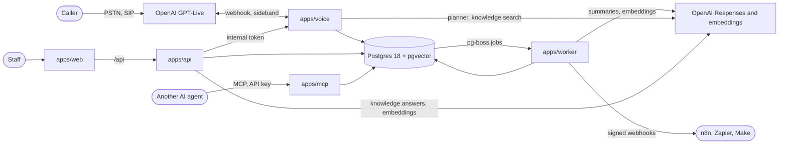
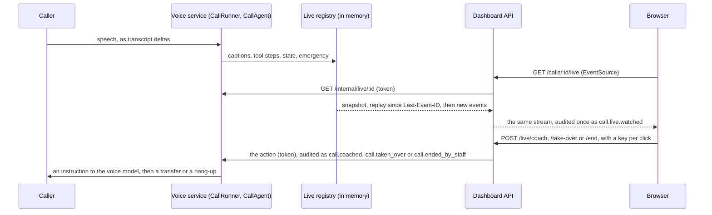

# Architecture

Attendra splits a phone call between two systems on purpose. GPT-Live holds the conversation: it listens, speaks, handles interruptions and decides when it needs help. Our backend holds the facts and the rules: who the caller is, what is free, what the caller agreed to, what is written, and who is told. The model never touches data directly.

## Paths

**Audio** goes Caller → PSTN → Twilio → Elastic SIP Trunk (TLS signalling, SRTP media) → `sip.api.openai.com`. On this direct-SIP path call audio never passes through our servers.

**Control** goes OpenAI → our webhook (`POST /webhooks/openai`) for the incoming call, then a sideband WebSocket (`/v1/live/sessions/{id}/attach`) for the rest of the call: transcripts, delegations, and our appends back.

## Components

| Component | Job |
|---|---|
| `apps/voice` | Verifies the webhook, de-duplicates deliveries, resolves the clinic from the dialled number, accepts or rejects, and starts a `CallRunner`. Answers 200 fast; the call is handled after. |
| `CallRunner` (`packages/voice-engine`) | The single owner of every side effect for one session. Drops replayed events by `event_id`, stores whole transcript turns, sends appends, performs transfers and hang-ups, records final usage on `session.closed`. |
| `CallAgent` (`packages/agent`) | The per-call brain. Holds no socket and no timers, so the same object runs under GPT-Live, a future Realtime engine, and the simulator. |
| `runTool` (`packages/agent`) | Where the rules are. Every tool call the planner makes goes through it. |
| Planner | Decides which tools to call for one delegation and what the result sentence is. `ResponsesPlanner` in production; `ScriptedPlanner` in tests and scripted evals. |
| `packages/core` | Pure rules with no I/O: clinic config, hours, slots, routing, identity parsing, confirmation, emergency phrases, and the ports the backend implements. |
| `packages/db` | SQL migrations, RLS, PHI encryption, repositories implementing the ports. |
| `apps/api` | The dashboard API (NestJS on Fastify). Better Auth handles sign-in, sessions and two-factor under `/api/auth`; every `/api/v1` route passes `StaffGuard`, then reads and writes through `FrontDeskRepository` inside the clinic's scope. OpenAPI at `/api/docs`. |
| `apps/web` | The staff dashboard (Next.js, Tailwind, TanStack Query). It proxies `/api` to the API, so the browser only ever talks to one origin. |
| `apps/worker` | Background jobs on pg-boss, in the same Postgres: a summary of every call, indexing the clinic's documents, webhook delivery with its retries, the nightly retention purge, and text delivery statuses behind a flag, which are not wired yet: nothing produces those jobs. |
| `apps/mcp` | MCP for other AI agents, over stdio and Streamable HTTP: find open times, today's schedule, the request queue, closing a request, the quality numbers. Per-clinic API keys with scopes and an expiry; no tool books or cancels. [docs/mcp.md](mcp.md). |
| `packages/webhooks` | Standard Webhooks signing, the SSRF guard (public HTTPS only, checked after DNS and pinned to the checked address), and one delivery. [docs/webhooks.md](webhooks.md). |
| `packages/knowledge` | The clinic's documents: text extraction (unpdf, in a worker thread with a heap limit and a 30 second deadline, at most 200 pages and 2 MB of text, with eval off), chunking, embeddings (OpenAI, or local hashing with no key), hybrid search with reciprocal rank fusion, and grounded answers. [Decision 8](decisions/0008-clinic-knowledge.md). |

## A delegation, in detail

1. GPT-Live sends `session.delegation.created` with a delegation id. It carries no task text; we rebuild the request from our own transcript and `CallState`.
2. `CallAgent.onDelegation` bumps the task revision and sends a `session.thinking.append` ("Working on it") so the model can keep the caller company.
3. The planner calls tools. `runTool` checks identity, offered slots, confirmations and idempotency before anything is read or written.
4. If a newer delegation started meanwhile, this result is dropped. Otherwise the result goes back as `session.commentary.append` for the model to say, capped well below the 500-token limit per append.

The emergency guardrail is not a delegation. It runs on every `session.input_transcript.delta`, over a rolling window of the caller's recent words, and appends a fixed `session.instructions.append` with `delegation_id: null` the moment it matches.

## The services

Postgres is the only store and the only queue: pg-boss keeps its jobs next to the calls they are about. The voice service, the API and the MCP server send jobs; only the worker runs them.

## Live calls

Staff can watch a call as it happens, send the assistant a note, take the call, or end it.

`CallAgent` emits a `LiveEvent` for every caption delta, every tool step as it starts and finishes (the tool's name and its result code, never argument values), each change to the verified caller, the pending read-back and what the assistant is doing, an emergency, a staff action, and the end. The voice service keeps them in a `LiveRegistry`: the calls running now, per clinic, each with a replay buffer of its last 2,000 events. A watcher gets a snapshot of where the call stands, the buffer after its `Last-Event-ID`, then each new event, with a heartbeat every 15 seconds. A stream ends when the call does, and after 60 minutes at most (the browser reconnects through the sign-in check), and every 5 minutes the API checks that the watcher is still signed in and may still read calls. A finished call stays in the registry for a minute, so a watcher still sees how it ended.

A coaching note reaches the voice model as an instruction marked as coming from staff. It changes nothing in code: `runTool` still refuses a booking without a read-back and a clear yes, a patient action before verification, and anything after an emergency, whatever the model does with the note. The audit row for a coaching note, a take-over or an end is written before the voice service is asked, in a transaction that is rolled back when the action did not happen or was a repeated click, so no action runs without its row. A take-over and an end are claims: the first one wins, the same click sent twice is the same claim, and anyone else is told who has the call. A browser test call cannot be transferred.

During an emergency, a coaching note is followed by the emergency script again, so a note cannot replace it, and End call is refused (`emergency_script`, 409) until the assistant's captions show the emergency number, or 20 seconds after the script was sent if they never do. When a transfer or a hang-up fails, the caller is still on the line: the claim is released so anyone can act again, a `transfer_failed` or `end_failed` staff event shows on the live page, and the assistant is told to offer a callback (with the emergency script again, during an emergency).

**One voice instance.** The registry lives in the voice service's memory, so the API must reach the instance that runs the call. That is the deployment Attendra supports today: one voice service. To run several, move the registry to Postgres. Each voice instance writes its events to a table keyed by call and event id, with the clinic's Row Level Security like any other call row, and sends a `NOTIFY` that carries only the call id and the new event id, because any database role can `LISTEN` on any channel. The API `LISTEN`s, reads the new rows inside `withClinic`, and streams them as today; `Last-Event-ID` becomes a query on the table. Staff actions become rows that the instance running the call picks up on its own channel. The HTTP contract to the browser does not change.

Simulated calls (`SimulatedEngine` in `packages/voice-engine`) play a scripted conversation into the real runner, agent, tools and database, with no audio and no model. The local demo turns them on so Live now has something to show without a phone or a key, and the e2e suite uses them to watch, coach and end a call.

## After a call

When a call closes, the voice service enqueues a `call.completed` job. The job's id is derived from the call id, so a second close, a retried webhook or a restart is still one job. The worker picks it up and queues the work every closed call needs; today that is `summarise-call`.

`summarise-call` reads the transcript and what the tools did (an audited PHI read), and asks the Responses API for a structured summary: two or three sentences for staff, the caller's intent, their sentiment, whether the call needs review and why, and a suggested follow-up. The output must match a strict JSON schema and is checked again with zod; the model's review flag is then combined with fixed rules, so a call is always flagged when it had emergency language, a caller who could not be verified, a record only staff can pick, the identity attempts used up, or an error at the end, whatever the model or the caller says. The dashboard labels the follow-up "Suggested by the assistant". The summary is encrypted into `call_summaries`, once per call, and the write is audited. Without an OpenAI key the worker writes the same shape from the call's facts alone, with no model.

A job that fails is retried with exponential backoff (15 seconds up to an hour, five times) and then moved to a dead-letter queue, where nothing retries it. Job data holds ids only, never patient data, and a failure is kept as a code (`summary_model_http_503`), never a message that could echo the transcript. The `worker_jobs` view shows each clinic its own jobs, and the call page says when a summary is still coming or could not be written.

**Webhooks.** The agent, the API and the worker emit domain events (a booking, a closed request, a finished call) through an `EventSink`. Each event has an id derived from what happened, so a retried booking is one event. The `webhook-event` job stores it and queues one `deliver-webhook` job per endpoint that wants it; a delivery is retried with backoff for about a day, logged at every attempt, and an endpoint that fails three events in a row is turned off. Emitting never fails the thing that happened: a booking stands whatever the queue does.

`purge-retention` runs at 03:00 UTC. For each clinic it deletes the transcripts, summaries and call actions of calls, and the webhook events with their delivery attempts, older than the clinic's `retentionDays` (2555 by default, about 7 years), in batches, and audits how many each batch deleted, never what. It runs as the database owner, like the migrations; the application role cannot delete call records.

## The dashboard

A request from the browser goes to the dashboard's own origin; Next forwards `/api` to `apps/api`. The session cookie is first-party and `SameSite=Lax`, and on top of that every write must carry the dashboard's own `Origin`.

`StaffGuard` then checks, in order: the session is valid; the person is not still on a temporary password (only `/me` answers until they change it); the person has two-factor on (skipped only in demo mode); on a clinic route, the person belongs to the clinic's organization and their role has the route's permission (the table is in `apps/api/src/access.ts`). A clinic someone does not belong to answers 404, so ids cannot be probed. After the guard, everything runs as `attendra_app` inside `withClinic`, like the voice path.

Reading a transcript or a task is a PHI access and writes an audit row in the same transaction as the read. A viewer's call list carries no patient data at all; for roles that may read calls it adds the verified caller's name, and that view is audited.

The schedule (`/clinics/:clinicId/appointments`) reads through `ScheduleRepository` in `packages/db` and writes through `StaffScheduler` in `packages/scheduling`. A staff booking is checked by `slotProblem`, which asks the same slot search the assistant's `find_slots` runs whether it would offer that time, and is written by `insertAppointment`, the function `BuiltinScheduler` uses for the assistant's bookings. The exclusion constraint on `appointments` is the last word on double booking for both. `GET /appointments/slots` returns open times with no patient data; every other schedule route shows names and is audited.

Patients (`/clinics/:clinicId/patients`) go through `PatientRecords`. Search is a `POST` with the query in the body; names and dates of birth are decrypted and matched in the API, a full phone number goes through its keyed hash ([decision 7](decisions/0007-patient-search.md)). Adding or editing a patient writes the same `lookup_hash` and `phone_hash` the voice agent looks callers up by. When the agent verifies a caller, the tool action that did it also sets `calls.patient_id` in the same transaction; that link is what lists a patient's calls.

## Data

Postgres 18 with pgvector is the only store. Every clinic table has `clinic_id` and a Row Level Security policy; requests run as a role that cannot bypass it, inside a transaction that sets the clinic. Names, dates of birth, phone numbers, transcript text, task details, appointment notes and call summaries are encrypted in the application with AES-256-GCM; lookups use keyed HMACs. The audit log is append-only by grant. Details: [decisions/0003-tenancy-and-phi.md](decisions/0003-tenancy-and-phi.md).
